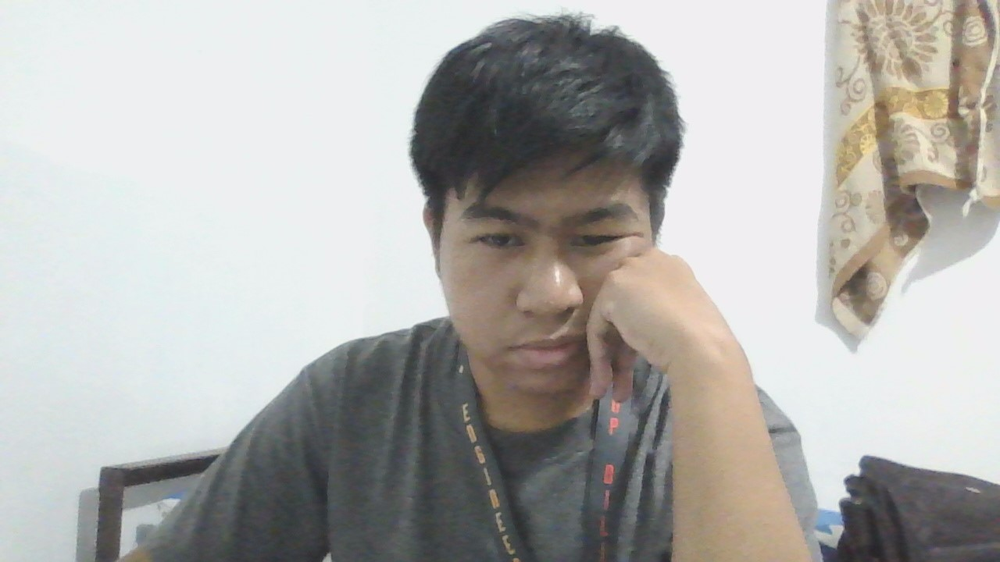

# Benedick Agamao Portfolio

Welcome to my personal portfolio website! Below you'll find details about my education, projects, and more.

---

## Dark Theme

The website is designed with a **dark theme** for better readability and aesthetics. Here is a brief overview of the layout:

### Layout:
- **Title**: "Benedick Agamao Portfolio" will be centered on the page.
- **Image**: My image is placed on the side, with the file name `Ben.jpg`.

---

## Education

Here, you can include details about your educational background. For example:

- **Degree**: Bachelor of Science in Geodetic Engineering 
- **University**: University of the Philippines Diliman
- **Year**: 4th Year, Batch 2025

You can add more details or a list of achievements here as well!

---

### Image Display
Make sure your `Ben.jpg` image is in the repository's folder (e.g., inside an `images` folder or the root directory). You can reference the image in HTML like this:

```html

